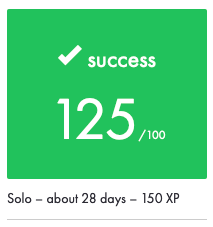
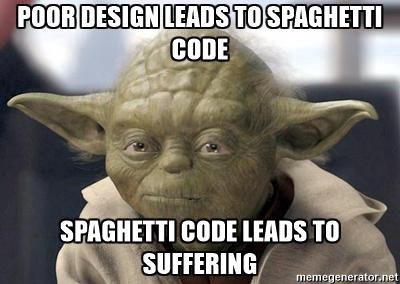
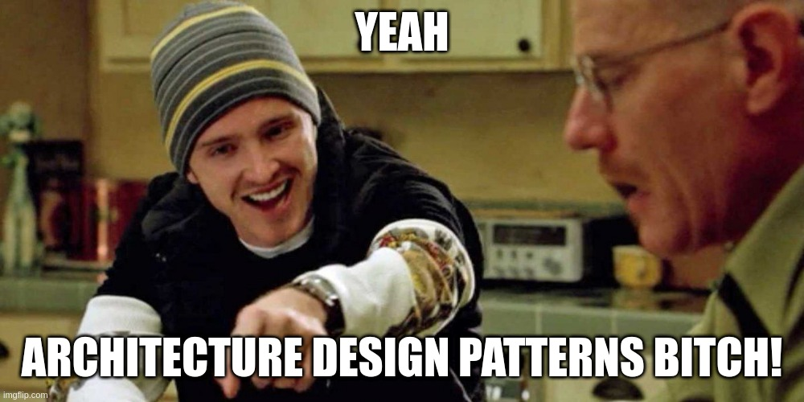
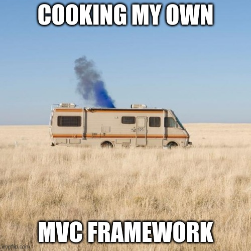

# camagru
The goal of this project is to build a small web application that allows you to take pictures using the webcam, and make basic photo editing using some predefined images. As with any other 42 project, there were some constraints:

* It had to be written in PHP.
* Every **framework**, **micro-framework** or **library** that you don’t create are totally **forbidden** (except for CSS frameworks that doesn’t need JavaScript).

## My approach
During the PHP piscine, I remember my frustration and sense of lost (😿) while doing the **first rush**. So when I started this project, I knew for sure I wasn't going to jump into coding without a proper strategy.

The same way people don't start building houses without some blueprint, software developers use [software architecture patterns](https://en.wikipedia.org/wiki/Software_architecture) to build apps. One of the most popular ones is the famous [MVC](https://en.wikipedia.org/wiki/Model%E2%80%93view%E2%80%93controller) (short for Model-View-Controller).

> Most popular [web frameworks](https://en.wikipedia.org/wiki/Web_framework) are based in this architectural pattern: [Ruby on Rails](https://rubyonrails.org/), [Django](https://www.djangoproject.com/), [Laravel](https://laravel.com/), etc.

No serious shop out there is building web apps without using any framework, either an existing one, or one developed in-house. But since already made frameworks were forbidden for this project, I figured I had to cook my own, and so I did. In doing so, I got to demistify the MVC and understood that often, behind enigmatic acronyms hide simple concepts that are there to simplify our work.

Next are the notes I wrote while doing this project (expect lots of memes and nonsensical remarks).

* [A dockerized LAMP stack](./README/docker_lamp.md)
* [What the heck is MVC, really](./README/mvc.md)
* [Routing](./README/router.md)
* [That model gives me the DB-jeebies](./README/model_class.md)
* [Controllers](./README/controller_class.md)
* [Views](./README/views.md)
* [Webcam Snapshots](./README/camera.md)
* [Sending mail](./README/email.md)

- [] Learn how to use [PHP namespaces](https://www.php.net/manual/en/language.namespaces.php).

---
[:arrow_backward:][back] ║ [:house:][home] ║ [:arrow_forward:][next]

<!-- navigation -->
[home]: #
[back]: #
[next]: ./README/docker_lamp.md