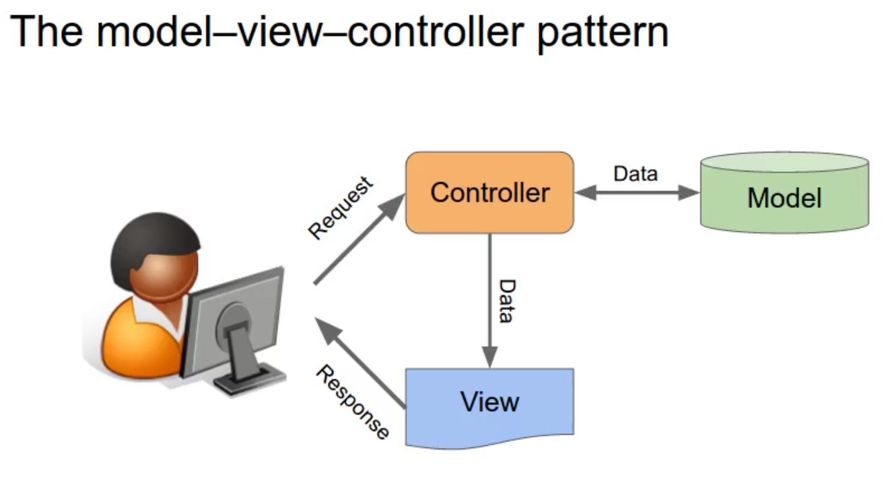
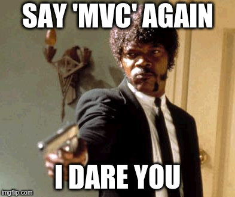
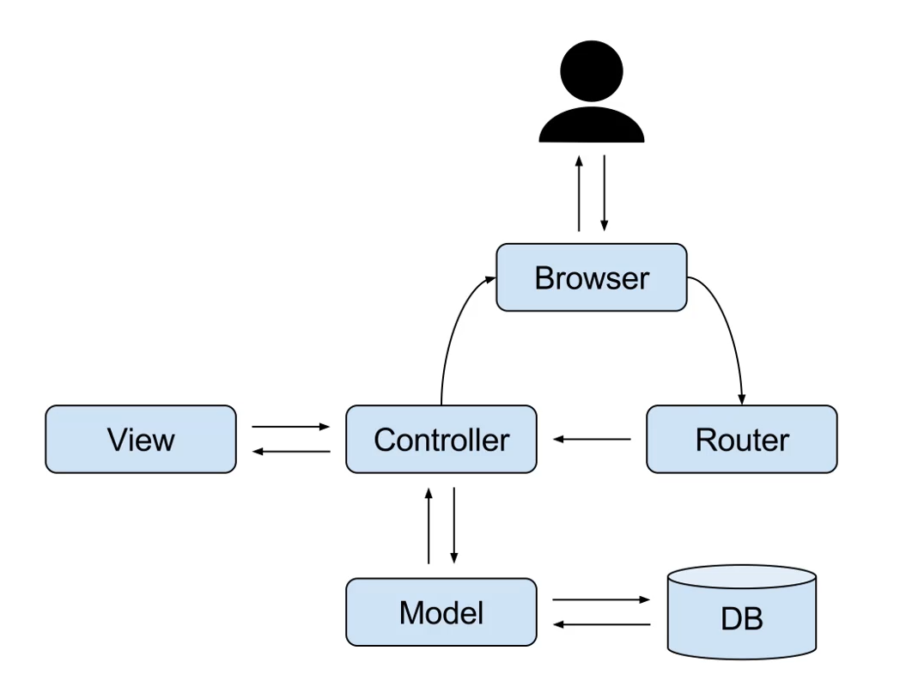

# MVC
[Model-View-Controller](https://developer.mozilla.org/en-US/docs/Glossary/MVC) is a software design pattern that emphasizes the [separation of concerns](https://en.wikipedia.org/wiki/Separation_of_concerns) between the [business logic](https://en.wikipedia.org/wiki/Business_logic) of our application (stuff that interacts with your database) and the [user interface](https://en.wikipedia.org/wiki/User_interface) (the front-end of your app). Some practical advantages of this approach are:

* Code **reuse**: the core MVC logic can be reused once and again in other projects. Also, quite often, it's turned into a Web framework, which can be made available to the open source community.

* Code **organization**: All the bad rap that PHP has gotten over the years, was due to developers writing code without a plan (or according to one that only them could understand 𓂀).

* If offers a set of **conventions** that serve as a common ground for developer teams. Any new developer that is added to the team, knows at once where everything goes (assuming that she's familiar with MVC). Also, since the app's UI is kept in different folders (views), designers can be working on the **UI** without messing with files that contain backend functionality.

* **Maintainable** code: if your browser is informing you about an SQL syntax error, you know exactly in what folder and files to look for it.

## Do I need it?
If you find yourself mixing up logic to access the database and displaying the retrieved data, all in the same file, you're violating one of the most basic principles of software development: **separation of concerns**. At the beginning of a project, it's tempting to start coding fast, mixing up business and presentation logic all together.

<p align="center"></p>

Web frameworks are there to protect you from shooting yourself in the foot. Or at least to protect you from feeling regretti with your bowl of spaguetti (meaning your app, dawg :joy:).

## The Big Picture
Nothing like a good diagram to get the party started:

<p align="center"></p>

* **Model**: This component is the one that takes care of the business logic. Here we put the code that:

  * Interacts with the database.
  * Communicates with the **controller** logic.
  * Implemented by a class with a **singular** name, e.g. `Post`.

* **View**: This refers to the UI that the users interact with in her browser. Basically the markup (including CSS and JS) with embedded **dynamic values** passed down by the **controller**.

* **Controller**: Here is where we write the logic that:

  * Receives and manages input from the user (URL requests).
  * Communicates with the **model** to get data from.
  * Pass requested data to the **view**.
  * Implemented by a class with a **plural** name, e.g. `Posts`.

## MVP
MVC was created in the late 1970s for developing **desktop applications** that implemented GUIs. Over time it has been **widely adopted** as a design paradigm for Web applications in major programming languages. Several web frameworks have been created that enforce the pattern. It also has resulted in several mutations of the original MVC pattern.

<p align="center"></p>

When it comes to **web applications**, we're talking about a program that runs in a **distributed environment** (user interface in one machine, business logic in the server), so a way of **bridging the gap** between the user interaction (generated in the browser) to the logic running in a far-away server was required. Check the following diagram:

<p align="center"></p>

As you can see, there's a new component labeled as **router**. This is where we put the logic that triggers **controller actions** depending on URL requests generated by the user in the browser. Since this routing part was not relevant in early MVC design, we can take two stances here:

* Stick to the **MVC** concept and consider the **routing** as part of the **controller**.
* Rethink the classic **MVC** as a modern [MVP](https://en.wikipedia.org/wiki/Model%E2%80%93view%E2%80%93presenter) architecture, (where **P** stands for **presenter**) in which the **presenter** takes the role of a (distributed) controller. In other words the middle-man between the **models** and the **views**.

<p align="center"></p>

> Imho, I don't think it's worthy spending time trying to pedantically define your design choice. The important part is to agree on some **blueprint** (better if it's a well known one) and stick to it.

## Implementation Details
In practice, the end result of all of this big talk is just a bunch of folders where we can keep our source code nice and tidy:
```
webapp
  ├── app
  │    ├── core
  │    ├── models
  │    ├── views
  │    └── controllers
  │
  └── public
          ├── index.php
          ├── css
          ├── img
          └── js
```

## The `app` folder
Here is where we'll keep most of the backend stuff:

* In the `core` folder we'll store:

  * Parent classes for **controllers** and **models**.
  * The **router** goes here too.
  * A class for connecting and querying the database.

* A folder for our `models`.
* Another one for the `controllers`.
* And one for the `views`.
* Some general app **configuration files**, which as a 42 requirement, must go in a `config` folder.

## The `public` folder
The `public` folder is the only publically accessible folder, the **root** of the webserver. Here we'll put our **static files** and the [front controller](https://en.wikipedia.org/wiki/Front_controller), which will handle **all requests** for our website.

> This being the only accessible folder makes our app more **secure** (database credentials, for example, are out of the way).

We have to configure our webserver so that this folder (and not our project folder) is the **web root**.

> Check the `Dockerfile` to see how I did that.

---
[:arrow_backward:][back] ║ [:house:][home] ║ [:arrow_forward:][next]

<!-- navigation -->
[home]: ../README.md
[back]: ./docker_lamp.md
[next]: ./router.md