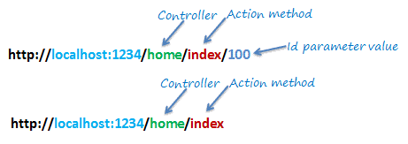

# The Router
A common design flaw that dates back to the times of the wild wild web, is writing our app so that individual scripts handle each URL request. For example, we'd have a `login.php` script to handle a request made agains `foo.com/login`, and so on. Why is that a bad idea? Think about what would you have to do, if your app has to deal with 100 different routes, write 100 files?

<p align="center"></p>

Matching URLs to individual scripts quickly becomes repetitive and **unmaintainable**.

## The Front Controller
The [front controller](https://en.wikipedia.org/wiki/Front_controller) is another design pattern that allows us to have a **single entry-point** in our application. Instead of mapping **URLs** to **individual scripts**, **all requests** (no matter their URLs) will go through the same file, `index.php`.

<p align="center"></p>

The main advantage of this approach is that it allows us to put all logic that is common to all requests in the same file without having to repeat ourselves.

## Query strings
OK, but if all requests are made against the same page, how do we trigger our backend logic? Easy, we use [query strings](https://en.wikipedia.org/wiki/Query_string). For example, to see the posts in a site we'd hit:
```
http://localhost/index.php?posts
```

> Everything after the **first question mark** is our **route**.

So a request against the URL above, would be routed through the front controller (`index.php`), to the `Posts` controller (which is a PHP class), where some of its methods would be invoked. But before that can happen, the **query string** must be parsed, so that the requests is routed to the proper controller/action. That is done in the **router** which we'll study in a bit).

> The **query string** will be parsed in an **instance** of the `Router` class (instantiated in `index.php`), and the **request** will be translated into a controller/action.

To understand how this works, add the following in your `index.php`:
```php
echo $_SERVER['QUERY_STRING'];
```

Now point your browser towards http://localhost/index.php?hello=world

> You can even remove the `index.php` part (http://localhost/?hello=world), because **by default**, it's the file that Apache serves from our webroot.

You should be seeing the `hello=world`, or whatever query string you write. Bottom line, whatever we write after the `?` sign, is available under `$_SERVER['QUERY_STRING']`.

### Pretty URLs
Apart from being able to remove the **front controller** from the URLs, adding a bit of server configuration we should be able of removing the first `?`, so that instead of http://localhost/?/posts?page=1 we get http://localhost/posts?page=1

> We'll use an extension ([mod_rewrite](https://httpd.apache.org/docs/current/mod/mod_rewrite.html)) of the Apache server that allows us to rewrite URLs using a `.htaccess` file.

This is the `.htaccess` file we must drop in our webroot:
```
<IfModule mod_rewrite.c>
  RewriteEngine On
  RewriteBase /
  RewriteCond %{REQUEST_FILENAME} !-d
  RewriteCond %{REQUEST_FILENAME} !-f
  RewriteRule  ^(.+)$ index.php?$1 [L,QSA]
</IfModule>
```

> Note that the `mod_rewrite` extension must be **enabled** (`sudo a2enmod rewrite`). Check out my `Dockerfile` to see how I enabled it.

Now, if you add in your front controller the line:
```php
echo 'Requested "' . $_SERVER['QUERY_STRING'] . '"';
```

Your browser will show whatever route you search for:

|           Requested URL           |     Your browser prints      |
| --------------------------------- | ---------------------------- |
| http://localhost/foo              | Requested "foo"              |
| http://localhost/foo=bar/spam=baz | Requested "foo=bar/spam=baz" |

Note that we don't even need the `?` at the beginning of our query string.

<p align="center"></p>

## Router
Routing a request is just parsing a **query string** and use its components to call an **action** (method) within a **controller** (class). To understand the simplicity behind all this, add the following to your `Router.class.php`:
```php
class Router {
    public function __construct()
    {
        echo 'Requested "' . $_SERVER['QUERY_STRING'] . '"';
    }
}
```

Now, in your **front controller** (`index.php`) you can require the class above, and instantiate it:
```php
require_once('../app/core/Router.class.php');

$router = new Router();
```

Now you can run the tests we run at the end of the last section.

> It's recommended to use [require_once](https://www.php.net/manual/en/function.require-once.php) and not [include](https://www.php.net/manual/en/function.include.php) to include our `Router` class in the **front controller**. If for some reason the `Router.class.php` file is not found, the application will come to a halt (which is good, because the router it all falls down).

### Autoloading
Having the `Router` class in a **separate file** (`Router.class.php`) allows us for [automatic loading](https://www.php.net/manual/en/language.oop5.autoload.php), so that the `Router` class doesn't have to be explicitely required in the **front controller** (it can be autoloaded with the other core components of our app).

### A Routing Table
There are a lot of ways of writing the **routing logic** for our application. Google around and you'll find really **sophisticated ways** (but cool tho) of doing that, for example using regular expressions mapped to regular expressions.

<p align="center"></p>

Since this application is a school project with just a few routes, creating a hardcoded list of routes should be more than enough.

<p align="center"></p>

Again, routing consists on:

1. Parsing the URL's query string (route).
2. Map its sections to a class and a method (controller and action).

A routing table is a hardcoded table that maps **routes** to **controllers/actions**. It's a simple way of routing the requests contained in the query strings to the proper scripts in our app. For example:

|     Route      | Controller | Action  |
| -------------- | ---------- | ------- |
| `/`            | `Home`     | `index` |
| `/posts`       | `Posts`    | `index` |
| `/post/3`      | `Posts`    | `show`  |
| `/post/edit/3` | `Posts`    | `edit`  |

Each **controller** will be a class, and each **action** a method within this class. Note that we're not naively matching routes against scripts.

### A Design choice
When designing our app, we have to make a design choice about how are we gonna structure our URLs:

<p align="center"></p>

The approach described in the diagram above is just one of many choices. Remember, you are the master of your app.

<p align="center"></p>

---
[:arrow_backward:][back] ║ [:house:][home] ║ [:arrow_forward:][next]

<!-- navigation -->
[home]: #
[back]: ./mvc.md
[next]: ./db.md