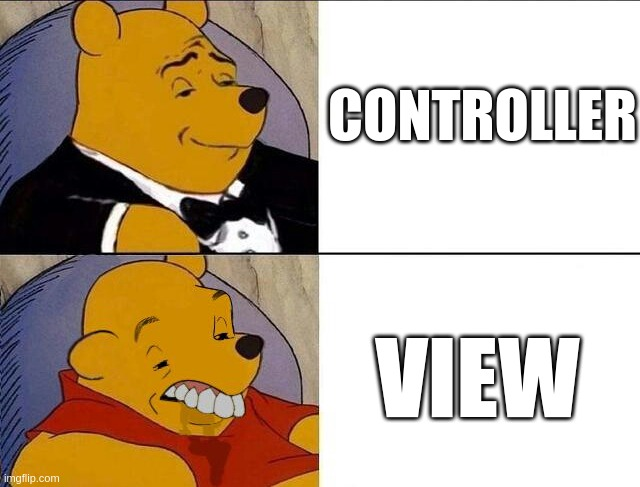

# The Views
In an MVC framework, the views are what we use to present the information to the user. They are usually made using some [template markup](https://en.wikipedia.org/wiki/Web_template_system), but since external libraries are forbidden for this project (and I'm not gonna reinvent the wheel writing a template engine), they will contain mostly HTML and just enough PHP to display the data.

Views are **stupid**, they don't contain any logic to deal with the database, the session or *anyting* like that. They should only contain a minimum amount of PHP, mostly `echo` statements, and some loops to print stuff repeatedly. This makes easy for a designer to work on the view files without having to touch the code under the controllers and models (separation of concerns).

> Once again, an MVC workflow reminder: when a URL request triggers an action in a **controller**, this one may retrieve some data (using an instance of a **model**), loads whatever **view** file is needed, and injects into it the retrieved data. That's all there is to MVC.

---
[:arrow_backward:][back] ║ [:house:][home] ║ [:arrow_forward:][next]

<!-- navigation -->
[home]: ../README.md
[back]: ./controller_class.md
[next]: ./camera.md